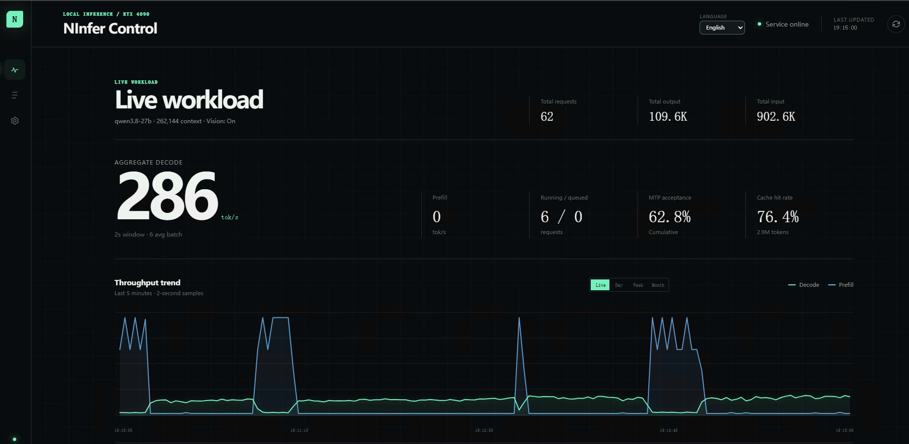
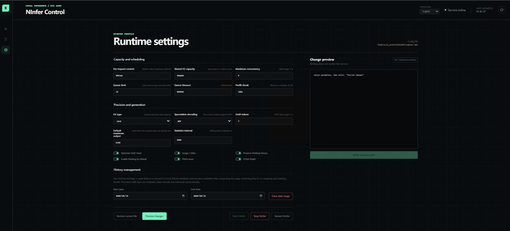

# NInfer-4090

NInfer-4090 runs **Qwen3.8-27B** on one NVIDIA GeForce RTX 4090, including both the standard
24 GB card and a 48 GB memory-upgraded card. It is an `sm_89` port of
[NInfer-3090](https://github.com/Don-Chad/ninfer-3090), which derives from
[Neroued/ninfer](https://github.com/Neroued/ninfer), a specialized C++20/CUDA inference engine.
The engine loads the official groupwise `.ninfer` artifact, serves OpenAI- and
Anthropic-compatible APIs, and supports paged KV, compatible-prefix reuse, CUDA Graphs, MTP
speculative decoding, reasoning-effort control, and ReplaySSM state transactions.

This fork targets `sm_89` and Linux. Blackwell-only NVFP4/W4A4 execution is unavailable; the
engine uses the same groupwise-int path as the 3090 base. The Windows path and the
Qwen3.6-35B-A3B target are inherited but untested on the RTX 4090.

## Measured results on the RTX 4090

Conditions: standard 24 GB RTX 4090, single request, greedy decoding, CUDA Graphs on, INT8 KV,
`--prefill-chunk 1024`, and the official 16.96 GiB Qwen3.8-27B artifact. The code-generation
decode row and the prefill rows are measured from the `ninfer-serve` `/metrics` counters
(computed prefill only); the other decode rows use the `ninfer` CLI.

| Test | Result |
|---|---|
| Decode, code generation, MTP3 | **148.6 tok/s** at 81.0% draft acceptance |
| Decode, bench corpus, MTP3 | 106.5 tok/s at 48.7% acceptance |
| Decode, no speculation | 50.5 tok/s |
| Decode at 128K depth, no speculation | 39.6 tok/s |
| 64K needle-in-a-haystack | exact answer, 1,849 tok/s prefill |
| 128K needle-in-a-haystack | exact answer, 1,561 tok/s prefill |
| Vision, chart reading | 3 of 3 oracle facts, 22 ms vision tower |
| Ops test suite | 78 of 78 runnable tests pass on `sm_89` |

MTP acceptance, and with it the decoded rate, tracks how predictable the output is: structured
code accepts about 81% of draft tokens, the mixed bench corpus about 49%.

The standard 24 GB text-only default has since moved from INT8 KV to the E8 4-bit KV mode,
which serves the model's full native 262,144-token context on this card. Retrieval stays exact
through 260K (single-needle, 5-needle, and exact-code-detail probes), MTP acceptance at depth is
unchanged, and the costs against the INT8 numbers above are a 5.7% decode tax and 1-2% of prefill; see
[Quick start](#text-only-full-262k-native-context-e8-4-bit-kv-default) for the measured deltas.

For scale: llama.cpp on the same card decodes the Qwen3.8-27B `UD-Q4_K_XL` GGUF at about
46 tok/s in a 144K-context configuration where the MTP buffers do not fit. The upstream engine
on an RTX 5090 measures 172 tok/s on the same code-generation prompts with a 400 W power cap
(the upstream README quotes about 200), so this card lands within 14% of it under MTP.

### Cross-backend speed and accuracy benchmark

The separate
[Qwen3.8-27B Local Inference Benchmark](https://github.com/pxzleo/qwen3.8-27b-local-inference-benchmark)
provides documented, partially reproducible speed and accuracy comparisons across this NInfer
deployment, q27 Q6_K, vLLM FP8, and a dual-GPU llama.cpp BF16 reference. It includes the serving
configurations, benchmark runner, methodology, curated per-request results, and aggregate accuracy
tables for an RTX 4090 48 GB workstation with an additional RTX 3090 24 GB used by the BF16
reference.

On its matched code-review workload, NInfer recorded the fastest single-request decode rate and
shared the leading four-request throughput tier with q27. The accuracy samples did not establish a
stable overall ranking, so the benchmark reports eligibility, truncation, and rerun results rather
than presenting speed as an accuracy proxy. See the benchmark repository for the full results,
limitations, and reproduction instructions.

### Depth sweep against llama.cpp

Both engines were measured on the same card. llama.cpp build 10358 ran `llama bench` on the
`UD-Q4_K_XL` GGUF (16.68 GiB) with q8_0 KV cache, flash attention, and `-ub 1024 -b 4096`,
which matches its deployed configuration, on 2026-08-15. The NInfer side was re-measured on
2026-08-17 on the deployed E8 262K configuration through the `/metrics` counters; the
llama.cpp configuration did not change between the dates. Two caveats: the artifacts differ
by about 2% in size, and `llama bench` is a bare kernel loop while the NInfer numbers
include the full server path.

Marginal rates at depth:

| Depth | llama.cpp pp2048 | llama.cpp tg32 | NInfer decode, no speculation |
|---:|---:|---:|---:|
| 0 | 3,024 tok/s | 45.9 tok/s | 50.4 tok/s |
| 32K | 2,327 | 42.0 | - |
| 64K | 1,866 | 38.6 | - |
| 128K | 1,336 | 33.1 | 42.1 |
| 256K | no entry | no entry | 36.6 |

Wall time to prefill one full prompt (llama.cpp integrated from the marginal rates, NInfer
measured):

| Prompt | llama.cpp | NInfer |
|---:|---:|---:|
| 32K | 12.5 s (2,630 tok/s) | 14.5 s (2,027 tok/s) |
| 64K | 28.3 s (2,317 tok/s) | 31.7 s (1,857 tok/s) |
| 128K | 70.4 s (1,862 tok/s) | 74.5 s (1,581 tok/s) |
| 192K | no entry | 127.9 s (1,381 tok/s) |
| 256K | no entry | 191.7 s (1,228 tok/s) |

The llama.cpp prefill lead narrows with depth. Server-measured, it prefills a 64K prompt in
28.7 s against 31.7 s (a 10% lead) and a 128K prompt in 71.6 s against 74.5 s (4%); the
server path costs llama.cpp 2-4% over the bare-loop estimates above. Everything past its
144K ceiling is NInfer-only. Decode inverts the shallow picture. NInfer leads by 10%
shallow and by 27% at 128K without speculation, and the MTP3 gap grows with depth:

| Workload | llama.cpp `draft-mtp` | NInfer MTP3 (E8) |
|---|---:|---:|
| Code, shallow | 118.8 tok/s at 85.9% acceptance | 142.9 tok/s at 78.0% |
| Prose, 64K depth | 55.5 tok/s at 45.3% | 86.1 tok/s at 42.3% |
| Prose, 128K depth | 42.3 tok/s at 45.4% | 77.5 tok/s at 41.6% |
| Prose, 256K depth | no entry | 65.4 tok/s at 41.1% |
| Code, 256K depth | no entry | 91.2 tok/s at 72.1% |

The NInfer rows in this table use the 2026-08-17 generated corpora; acceptance on them runs
a few points below the 2026-08-15 payloads (code 78% against 81%), which accounts for the
difference from the headline 148.6 tok/s. The llama.cpp MTP rows required a reduced
131,584-token context; the draft buffers push VRAM
to 23.8 of 24 GiB, and the deployed 144K llama.cpp configuration cannot fit them at all.
NInfer serves 172,032 tokens with MTP in the same VRAM at INT8 KV, and the full native
262,144 with the E8 4-bit KV default. Acceptance matches per content type, so the decode gap
is engine time, not draft quality.

Full configurations, method, and raw numbers:
[NInfer against llama.cpp](docs/llamacpp-comparison.md).

## Quick start (Linux)

Requirements: an RTX 4090 with 24 GB or 48 GB of usable VRAM, a recent NVIDIA driver, Docker
Engine with the Docker Compose v2 plugin, and the NVIDIA Container Toolkit. The 48 GB profile
is intended for memory-upgraded RTX 4090 boards; confirm that the full capacity is visible in
`nvidia-smi` before starting the service.

Build the image and download the model once:

```bash
docker build --tag ninfer-4090:sm89 .
NINFER_MODEL_DIR="$PWD/models" bash scripts/download-qwen38.sh
```

Then start the included 48 GB Compose profile or one of the three 24 GB profiles below. The API
is available at `http://127.0.0.1:8080/v1`.

The three 24 GB `docker run` profiles below use one generation slot. Extra requests wait in the
admission queue. `--max-concurrency 2` is measured and worthwhile on the 4090: the second lane
costs about 390 MiB (state pools plus a
doubled CUDA-graph allowance) while the KV page pool stays shared, so a lone session
still uses the full context; single-stream decode is unregressed and two sessions
decode batched at roughly 1.5x aggregate throughput, each lane keeping its own
resident prefix. Prefill still serializes across lanes, so a deep cold prefill
delays the other lane's first token.

Add `--turn-checkpoints 32` when clients edit conversation history (agent memory
updates, message rewrites, regenerated turns): the server then re-prefills from
the nearest retained turn boundary instead of from zero. The ring costs host
memory only, about 4.6 GiB per slot at 32 entries. See
[docs/turn-checkpoint-ring.md](docs/turn-checkpoint-ring.md).

Extra requests beyond the slots wait in the admission queue, and the queue deadline
defaults to 30 seconds. A deep prefill can hold a slot longer than that, so
parallel agent clients would fail with `request_queue_timeout`. The
`--pending-timeout-ms 600000` line raises the deadline to 10 minutes. On a
streaming request the timeout arrives as an in-band SSE error event after HTTP 200;
a client that does not parse error events sees a stream that ends without a
`finish_reason`. See [docs/serving.md](docs/serving.md) for the full queue
contract.

### RTX 4090 48 GB profile: 262K context, vision, and concurrency

The repository includes [`compose.yaml`](compose.yaml) for a 48 GB memory-upgraded RTX 4090.
It keeps image and video input enabled while using INT8 KV cache, the model's full native
262,144-token per-request context, a 524,288-token shared KV pool, and up to eight execution
slots:

```bash
docker compose up --build -d ninfer
curl --fail http://127.0.0.1:8080/health
```

The important settings in the supplied profile are:

| Setting | Value | Meaning |
|---|---:|---|
| `--max-context` | `262144` | Maximum context for one request |
| `--kv-capacity` | `524288` | Shared KV capacity across all active requests |
| `--max-concurrency` | `8` | Maximum number of execution slots, not eight full 262K contexts |
| `--kv-dtype` | `int8` | Higher-precision KV cache than the compressed E8 profiles |
| `--vision` | enabled | Loads image/video processing support |
| `--spec mtp --draft-tokens 3` | enabled | MTP speculative decoding |
| `--log-stats-interval-ms` | `2000` | Two-second runtime statistics for the monitoring UI |

`--max-context` is a per-request limit, while `--kv-capacity` is shared. With the supplied
values, the scheduler can run up to eight requests when their combined live KV usage fits
within 524,288 tokens; it cannot hold eight independent 262K contexts at once. Increasing
concurrency usually improves aggregate throughput for multiple clients, but reduces the GPU
time available to each request and can increase latency. The published performance tables in
this README remain single-request measurements on the standard 24 GB card.

To stop the service without deleting the model or history data:

```bash
docker compose stop ninfer
```

### Text-only, full 262K native context (E8 4-bit KV, 24 GB default)

The E8 Conway-Sloane lattice KV mode (`rk4v4-e8`, ported from
[UDPSendToFailed/ninfer-4090](https://github.com/UDPSendToFailed/ninfer-4090); see
[the fork comparison](docs/udp-fork-comparison.md)) fits the model's entire native
262,144-token context on 24 GB with 1.4 GiB to spare:

```bash
docker run --rm --gpus all --publish 8080:8080 \
  --volume "$PWD/models:/workspace/models:ro" \
  ninfer-4090:sm89 \
  ninfer-serve models/qwen3_8_27b.ninfer \
  --host 0.0.0.0 --port 8080 \
  --max-context 262144 --kv-capacity 262144 \
  --max-concurrency 1 --max-pending-requests 16 \
  --pending-timeout-ms 600000 \
  --prefill-chunk 1024 --kv-dtype rk4v4-e8 \
  --spec mtp --draft-tokens 3 --lm-head-draft \
  --preserve-thinking --reasoning-language zh-CN
```

Measured against INT8 KV on this build: identical MTP acceptance at 111K depth
(78.8% vs 78.4%), a 5.7% decode tax (126.6 vs 134.2 tok/s on a shallow greedy code
probe), prefill within 1-2% at matched depth, and exact single-needle, 5-needle, and
code-detail retrieval through 260K tokens.

### Text-only, 168K context (INT8 KV, maximum precision)

```bash
docker run --rm --gpus all --publish 8080:8080 \
  --volume "$PWD/models:/workspace/models:ro" \
  ninfer-4090:sm89 \
  ninfer-serve models/qwen3_8_27b.ninfer \
  --host 0.0.0.0 --port 8080 \
  --max-context 172032 --kv-capacity 172032 \
  --max-concurrency 1 --max-pending-requests 16 \
  --pending-timeout-ms 600000 \
  --prefill-chunk 1024 --kv-dtype int8 \
  --spec mtp --draft-tokens 3 --lm-head-draft \
  --preserve-thinking
```

### With vision, full 262K context (E8 4-bit KV)

The vision scratchpad defaults to 8192 tokens (`--vision-max-tokens`, ported from
the same fork as the E8 KV modes) instead of the former hardcoded 32768. The
smaller scratchpad frees about 1.5 GiB, so the full native context fits next to
vision on 4-bit keys:

```bash
docker run --rm --gpus all --publish 8080:8080 \
  --volume "$PWD/models:/workspace/models:ro" \
  ninfer-4090:sm89 \
  ninfer-serve models/qwen3_8_27b.ninfer \
  --host 0.0.0.0 --port 8080 \
  --max-context 262144 --kv-capacity 262144 \
  --max-concurrency 1 --max-pending-requests 16 \
  --pending-timeout-ms 600000 \
  --prefill-chunk 1024 --kv-dtype rk4v4-e8 \
  --spec mtp --draft-tokens 3 --lm-head-draft \
  --vision --preserve-thinking
```

The scratchpad bounds the image tokens per request, not the conversation depth:
a 51K-token conversation with an attached image completes normally. One
1024x1024 image costs 1026 vision tokens, so the default fits about seven
maximum-size images per request. The server rejects a request over the limit
with `media_budget_exceeded` before the request reaches the encoder. For dense
video workloads, raise the limit with `--vision-max-tokens`. Each additional
1024 tokens of scratchpad costs about 62 MiB of VRAM.

### The tradeoff

KV precision, vision, and maximum context trade against each other on a 24 GB card:

| Profile | KV mode | Context | KV runtime | Startup slack |
|---|---|---:|---:|---:|
| Text-only, MTP3 | `rk4v4-e8` | 262144 (256K) | 5.08 GiB | 1.37 GiB |
| Text-only, MTP3 | `rk2v4-e8` | 262144 (256K) | 4.01 GiB | 2.43 GiB |
| Text-only, MTP3 | `int8` | 172032 (168K) | 6.31 GiB | 136 MiB |
| With `--vision`, MTP3 | `rk4v4-e8` | 262144 (256K) | 5.41 GiB | 780 MiB |
| With `--vision` (32K scratchpad), MTP3 | `rk2v4-e8` | 262144 (256K) | 5.85 GiB | 329 MiB |
| With `--vision` (32K scratchpad), MTP3 | `rk4v4-e8` | 212992 (208K) | 6.06 GiB | 108 MiB |
| With `--vision` (32K scratchpad), MTP3 | `int8` | 98304 (96K) | - | ~1 GiB |

262,144 is the model's own context limit, so `rk2v4-e8` (2-bit keys, 96.2% cosine)
buys no additional context over `rk4v4-e8` in the text-only profile - only slack.
That slack is what pays for vision. With the former hardcoded 32,768-token vision
scratchpad, vision cost about 2.1 GiB (1.83 GiB of runtime buffers plus a
0.28 GiB tower): INT8 could only afford it at 96K, 4-bit keys topped out at
212992, and only 2-bit keys fit the full 262,144. The default 8192-token
scratchpad cuts the cost to about 0.6 GiB, and the full native 262,144 now fits
alongside vision on 4-bit keys with 780 MiB of slack. The vision
modes answer a two-swatch color oracle exactly at temperature 0, including with
the image buried under 52,700 tokens of text on `rk2v4-e8`. `rk2v4-e8` also passes
the text retrieval gates (single-needle at 260K, 5-needle at 118K, exact code
details at 168K) at a 10% decode tax (120.5 tok/s on the shallow code probe). The
INT8 text-only ceiling is near 176K: 172032 starts, and 196608 is rejected at
startup with a byte-exact deficit. The server validates memory before it listens,
so an oversized context fails fast instead of at request time.

For a native build, follow the [Linux build guide](docs/rtx-3090-linux.md) with
`CMAKE_CUDA_ARCHITECTURES=89` (the default in this fork). The build requires CUDA 12.8 or newer,
GCC 13, and CMake 3.28 or newer; the Docker image builds with CUDA 13.1.

## NInfer Control UI

This repository includes a lightweight local monitoring and configuration interface in
[`ninfer_ui/`](ninfer_ui/). It uses only the Python standard library and reads NInfer's health,
metrics, slot, model, Docker-log, and `nvidia-smi` data. Start NInfer first, then run the UI from
the repository root:

```bash
python3 ninfer_ui/server.py --host 127.0.0.1 --port 8081
```

Open <http://127.0.0.1:8081>. The interface supports Chinese and English, follows the browser's
preferred language by default, and remembers a manual language selection in that browser.

### Interface preview



*Live workload view with aggregate and per-slot activity, cache and MTP statistics, cumulative
token counters, and the interactive throughput timeline.*



*Runtime settings view for the 48 GB profile, including capacity and scheduling, precision and
generation options, direct configuration saving, history management, and NInfer service controls.*

### Live status and history

- Refreshes every two seconds with aggregate decode and prefill rates, running and queued
  requests, average batch size, cumulative token counts, MTP acceptance, and cache hit rate.
- Shows every execution slot's prefill progress, independent decode rate, scheduling state, and
  page-aligned resident Main KV usage; per-slot usage sums to the total cache occupancy.
- Shows page-aligned total Main KV cache occupancy, including retained prefixes, against the
  resolved shared KV capacity.
- Reports GPU utilization, VRAM, temperature, power, and SM clock, followed by the LAN API
  address derived from the current UI hostname and the model name reported by `/v1/models`.
- Persists and displays the latest 50 completed requests with input/output tokens, cache hit rate,
  TTFT, decode rate, wall time, finish reason, and speculative-decoding statistics. The list
  survives UI restarts and no longer shrinks as throughput lines roll through Docker's log tail.
  Each row opens a keyboard-accessible request inspector with completion time, prefill and decode
  performance, cache details, MTP statistics, and the exact source log record.
- Provides raw Docker logs with two-second auto-refresh and automatic scrolling to the latest
  line.
- Plots live, calendar-day, calendar-week, and calendar-month throughput. Hover over a curve,
  or tap it on a touch device, to inspect the nearest plotted sample or aggregate point's local
  time, decode rate, and prefill rate.
- Keeps raw two-second history for the latest five minutes and stores peak-preserving average
  aggregates in `ninfer_ui/history.sqlite3`. Aggregate history survives UI and NInfer restarts,
  and records older than 400 days are removed automatically.

### Configuration and service control

The configuration page edits the supported NInfer options in [`compose.yaml`](compose.yaml),
validates values, and saves them directly after confirmation. Saving a configuration creates a
backup under `ninfer_ui/backups/` and uses a revision check to avoid overwriting an external
file change. Saving the file does **not** restart NInfer; use the separate start, stop, or
restart controls when the new startup configuration should take effect. Stop and restart
interrupt active and queued inference requests and therefore use a standard confirmation dialog.
The page also configures Qwen3.8's default reasoning level as Off, Low, Medium, or High. Off maps
to `--no-thinking`; the other levels are written explicitly as
`--reasoning-effort low|medium|xhigh`. A separate Chinese reasoning switch is off by default.
Enabling it writes `--reasoning-language zh-CN`; disabling it removes the option and restores the
template's default language behavior. Reasoning history remains controlled independently by
`--preserve-thinking`. Changes take effect after saving and restarting; the UI labels the switch as
applying to new sessions.

The same page can delete throughput history for an inclusive local-calendar date range. This
operation is irreversible and requires a typed confirmation phrase. It does not disable future
history collection.

The supplied Compose profile publishes the NInfer API on `0.0.0.0:8080`, making it reachable from
the local network through the host's LAN address. It does not configure router port forwarding or
an API key; use a trusted LAN, restrict port 8080 with the host firewall, or add `--api-key` before
serving untrusted clients. The UI remains loopback-only on `127.0.0.1:8081` by default and also
validates the client address, `Host`, `Origin`, JSON content type, and confirmation phrases for
mutating operations. The account running the UI must have permission to use Docker for the
container status, throughput logs, recent-request data, raw-log view, and service controls;
without that permission, those parts of the UI are unavailable. Environment overrides and
additional details are documented in [`ninfer_ui/README.md`](ninfer_ui/README.md).

Run the UI test suite with:

```bash
python3 -m unittest discover -s ninfer_ui/tests -v
```

## What this fork changes

- **`sm_89` retarget.** The CMake architecture pin, the runtime compute-capability check, and the
  NVFP4 stub gate now select `sm_89`. Most SM86 kernel schedules run unmodified on Ada; the
  INT8 attention prefill schedule is retuned (below).
- **Ada-retuned INT8 attention prefill.** The SM120 schedule spills registers on Ada and pays the
  consumer half-rate penalty for f32-accumulate HMMA. Arch-gated for `sm_89`: the full
  128-register budget, eight paired producer warps over `Bc` column halves with one named-barrier
  exchange per key tile, byte-permute V dequantization (bit-identical), and fp16-accumulated PV
  tiles folded into the fp32 running accumulator each tile. The kernel gains 30% at 64K depth
  (109 to 143 TFLOP/s on the `d256-h24-kv4` INT8 append shape); serve prefill gains 5-7% at
  88K-128K. Needle-in-a-haystack retrieval stays exact at both depths and all 84 suite tests
  pass, which bounds the fp16-accumulation numerics change.
- **Causal-tile partitioned key-block traversal.** Interior key blocks (wholly below the causal
  diagonal for the whole CTA tile) run a separate instantiation of the key-block body: KV stages
  with unconditional copies and the softmax drops its masking selects; boundary blocks keep the
  exact masked path. The idea comes from the
  [UDPSendToFailed fork](https://github.com/UDPSendToFailed/ninfer-4090) (c5f70526),
  re-implemented inside the retuned schedule above. Kernel: 144 to 165 TFLOP/s at 32K-224K
  context on the INT8 append shape (-12 to -13% latency), register count unchanged, bit-exact.
  End-to-end this is bounded by the attention wall share of this hybrid-GDN model: about +1%
  serve prefill at 51K on INT8 KV, within noise on the E8 modes, whose staging time is dominated
  by lattice decode rather than the removed guards.
- **`/v1/models` reports `context_window`.** Clients without access to a llama.cpp `/props` or a
  vLLM `max_model_len` can size prompts from the models payload.
- **llama.cpp-compatible `timings` on chat completions.** Responses and final stream chunks carry
  a top-level `timings` block (`prompt_n`/`predicted_n`, per-second rates, `ttft_ms`, `cache_n`,
  `draft_n`/`draft_n_accepted`), so proxies such as llama-swap show per-request prefill and decode
  rates, MTP draft acceptance, and prefix-cache hits. Contributed by the
  [shantanusingh16 fork](https://github.com/shantanusingh16/ninfer-4090) of this repository.
- **`GET /metrics`.** Prometheus counters under llama.cpp-compatible names
  (`llamacpp:prompt_tokens_total`, `llamacpp:prompt_seconds_total`,
  `llamacpp:tokens_predicted_total`, `llamacpp:tokens_predicted_seconds_total`,
  `llamacpp:requests_processing`, `llamacpp:requests_deferred`), so existing scrapers read this
  server without changes. Prompt tokens count only computed prefill; prefix-cache hits are
  excluded, as in llama.cpp. Additional `ninfer:` series report request totals, prefix-cache
  hits, MTP draft/acceptance totals, and page-aligned Main KV used/capacity tokens.
- **`GET /slots`.** A llama.cpp-shaped slot table built from the engine's real runtime lanes.
  Busy slots report request identity, phase, generated tokens, reusable and processed prompt
  tokens; every slot reports page-aligned Main KV occupancy. Idle retained slots keep their real
  lane attribution, resident depth, stable `session_digest`, and checkpoint metadata.
- **Slot session save/restore.** `--slot-save-path DIR` (off by default) enables llama.cpp-style
  `POST /slots/{id}?action=save|restore|erase`: one idle slot's complete resident session -
  paged Text and MTP KV, GDN linear-attention state, turn checkpoint, and prefix identity -
  moves to or from disk, and a restored slot reuses the cache across server restarts instead of
  re-prefilling (a 6.9k-token session restores in about 0.1 s against a multi-second reprefill).
  Sessions are identified by a stable `session_digest`; chat completions carry `id_slot` and the
  digest next to `timings`, and `save`/`erase` accept an `if_digest` precondition checked
  atomically, so a client always persists exactly the session it means. Restore extends the
  saved frontier (or its turn checkpoint); the GDN state cannot rewind further, and the DFlash
  backend is not supported. Details in [docs/serving.md](docs/serving.md).
- **Reuse-aware lane choice.** When prefix reuse ties (typically zero for a fresh session),
  admission picks the lane whose occupation costs least to replace - an empty lane before any
  retained session, then the shallowest - so a burst request no longer evicts a deep resident
  session while a free lane exists.
- **Turn checkpoint ring.** `--turn-checkpoints N` (off by default) keeps up to N past turn
  checkpoints per slot in host memory. A prompt that rewrites the middle of its history -
  an edited message, an updated agent memory block, a regenerated earlier turn - restores at
  the deepest checkpoint below the edit instead of re-prefilling from zero; generation after
  the restore is greedy-identical to a cold prefill. One checkpoint holds the GDN
  linear-attention state (about 147 MiB of host memory on Qwen3.8-27B); the attention KV
  needs no copy. Slot snapshots carry the ring across restarts (format version 2, written
  only when the ring is non-empty, so existing files stay readable everywhere). The
  recommended value is 32. Details in
  [docs/turn-checkpoint-ring.md](docs/turn-checkpoint-ring.md).
- **Auto-save on eviction.** `--auto-save-evicted` (off by default, requires
  `--slot-save-path`) spills an involuntarily evicted session - checkpoint ring included -
  back to the slot file it was last saved to or restored from, before the eviction destroys
  it. Rotating more sessions than slots then loses nothing: the next restore recovers the
  session at its latest frontier. Explicit `erase` never auto-saves.
- **NVFP4-A4 test gating.** The A4 activation tests skip on hardware without FP4 tensor cores
  instead of aborting. The full remaining suite passes on the RTX 4090.
- **E8 lattice KV quantization (ported).** The `rk8v4`/`rk4v4`/`rk4v4-e8`/`rk2v4-e8` KV modes
  and the 262K-to-1M visible-keys envelope lift from the
  [UDPSendToFailed/ninfer-4090](https://github.com/UDPSendToFailed/ninfer-4090) sibling fork,
  merged under this fork's retuned `sm_89` attention prefill schedule. The E8 codec verifies
  bit-exactly against the upstream microbenchmark (96.155% / 98.678% cosine); their 1 GiB
  CUDA-graph allowance bump was deliberately not taken (it would evict the INT8 168K profile).
  Method and measurements in [docs/udp-fork-comparison.md](docs/udp-fork-comparison.md).
- **Configurable vision scratchpad (ported).** `--vision-max-tokens` comes from the same fork
  and sizes the vision encode workspace (default 8192 tokens, formerly hardcoded 32768). This
  fork additionally wires the processor media budget to the same limit, so an over-limit
  request fails as `media_budget_exceeded` instead of reaching an undersized encoder.

## Known limits on the RTX 4090

- Prefill trails llama.cpp by 16-24% on full 32K-128K prompts under matched conditions (see
  the depth sweep above). The rate is flat across `--prefill-chunk` 1024 to 2688, so the
  chunk size is not the lever. With the attention schedule retuned, the remaining gap sits in
  the custom quantized GEMMs, which run about 10% below cuBLAS on Ada. Decode is where this
  engine leads.
- Keep `--prefill-chunk` at 2688 or below. This fork carries measured `sm_89` cooperative
  residency tables (the former hard abort above chunk 1024 is fixed), and chunks through 2688
  stay on split-K. Larger chunks route to the unsplit schedule, which is marginally less
  accurate at its onset (about 1e-5 relative).
- The published benchmark results are single-request measurements. The 48 GB Compose profile
  exposes eight execution slots, but standardized multi-request scaling results are not yet
  published; per-request latency and aggregate throughput depend on prompt depth, decode mix,
  and shared KV pressure. `--max-concurrency 2` has been measured on a standard 4090, but those
  results and the cohort results in the
  [3090 base](https://github.com/Don-Chad/ninfer-3090) do not transfer directly.
- Prefill is strictly serialized across lanes with no chunk-level interleaving, and decode
  starves while any prefill runs: a short request submitted behind a 31k-token cold prefill
  measured a 13.5 s first token. Concurrency pays off for decode and for per-lane resident
  prefixes, not for prefill fairness.
- The limits of the base engine apply: one process, one GPU, one model, bounded FIFO admission,
  no multi-GPU execution, no weight offload.

## Artifact

| Model | Artifact | Size |
|---|---|---:|
| Qwen3.8-27B | [official NInfer groupwise artifact](https://huggingface.co/neroued/Qwen3.8-27B-NInfer) | 16.96 GiB |

The artifact is architecture-independent; the model card's RTX 5090 requirement describes the
upstream engine, not the file. Verify the download against the SHA-256 published on the card.

## Reasoning effort

Qwen3.8-27B has three trained reasoning depths plus an off switch. OpenAI Chat Completions
accepts a top-level `reasoning_effort` field (`low`, `medium`, `xhigh`) and either the top-level
`enable_thinking` alias or `chat_template_kwargs.enable_thinking`; hidden reasoning returns
separately as `message.reasoning_content`. Contradictory aliases are rejected. For the CLI, pass
`--reasoning-effort` or `--no-thinking`. Sampling defaults come from the model card and switch
with the thinking mode. To steer the complete reasoning trace and default answer language to
Simplified Chinese, add `--reasoning-language zh-CN`. To explicitly steer new reasoning toward
English, use `--reasoning-language en-US`.
Both modes combine a system constraint with a short task-focused seed after `<think>`. The seed
anchors the generated language without exposing the language rule as reasoning content. This is
prompt steering rather than a character-level mask, so code and technical terms remain usable.
`--preserve-thinking` independently controls whether prior reasoning traces remain in later prompts;
language steering does not override that setting.

## Serving APIs

OpenAI Chat Completions, OpenAI Responses with streaming and local continuation state, Anthropic
Messages, prompt-rendered function tools with parsed tool calls, compatible-prefix reuse, and
JSONL request logs. See [HTTP serving](docs/serving.md) and [CLI usage](docs/cli.md).

This branch also carries selected compatibility and Ada fixes from adjacent forks: Chat
Completions reports `usage.prompt_tokens_details.cached_tokens`; tool-call arguments preserve
JSON strings when the declared schema type is `string`; greedy decoding bypasses sampling
penalties after grammar rejection; CUDA Graph sizing reserves a concurrency-aware floor; and the
Q5 Ada row-split schedule uses a narrower 17-64-token prefill route. On this repository's 48 GB
RTX 4090, the last change raised the matched short-prefill median from 420.0 to 428.1 tok/s
(10 measured requests after two warmups, about 1.9%). `--image-token-budget N` additionally caps
each image to `N` 32x32 vision tokens; zero preserves the artifact ceiling.

## Upstream and credits

- [Neroued/ninfer](https://github.com/Neroued/ninfer) - the engine, developed for the RTX 5090
  (`sm_120a`).
- [Don-Chad/ninfer-3090](https://github.com/Don-Chad/ninfer-3090) - the SM86 compatibility layer,
  ReplaySSM integration, and Qwen3.8 runtime support this fork builds on. Its
  [v0.6.1 release notes](RELEASE_NOTES_0.6.1.md) describe the inherited state.
- [UDPSendToFailed/ninfer-4090](https://github.com/UDPSendToFailed/ninfer-4090) - a sibling
  RTX 4090 port from the same 3090 base. The rotated and E8-lattice KV-cache quantization
  modes (`rk8v4`, `rk4v4`, `rk4v4-e8`, `rk2v4-e8`), the E8 codecs, and the 1M visible-keys
  envelope are their work, cherry-picked here with authorship preserved. The full 262K
  default profile exists because of it; see
  [the fork comparison](docs/udp-fork-comparison.md).
- [jram4/ninfer-4090](https://github.com/jram4/ninfer-4090) - an earlier RTX 4090 port of a July
  2026 snapshot. Its Ada dispatch tuning targets a kernel organization that upstream has since
  replaced, so this fork starts from the current 3090 base instead.

## License

Apache License 2.0. See [LICENSE](LICENSE).
